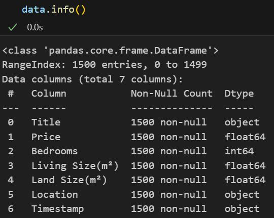
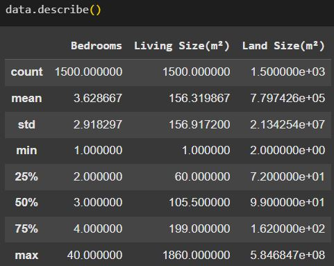
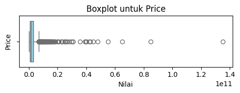
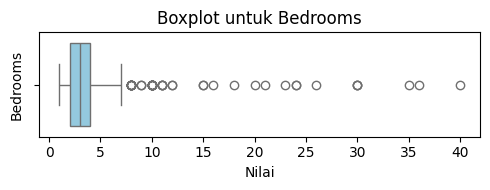
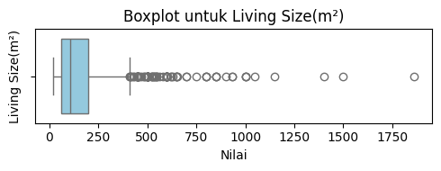
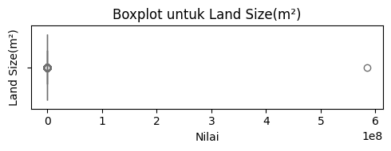
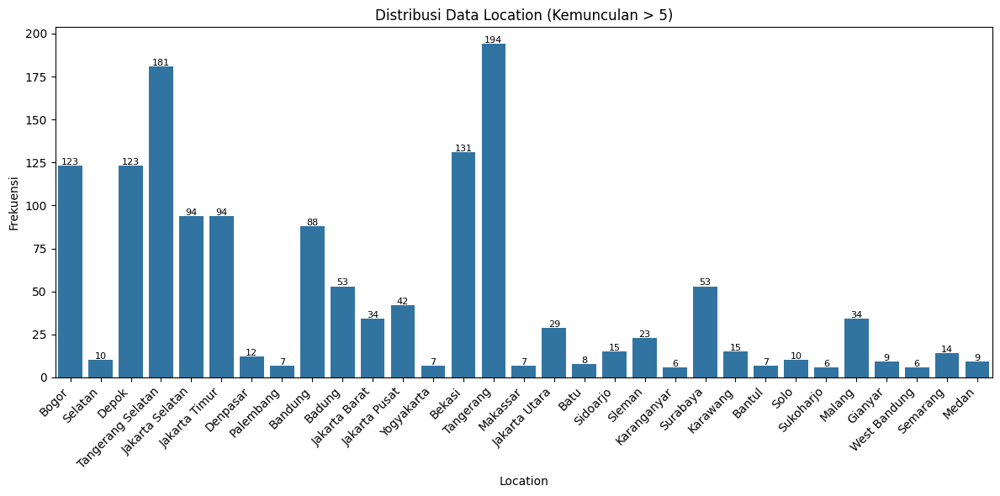
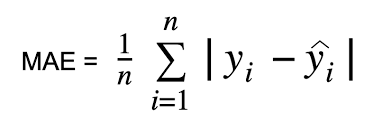
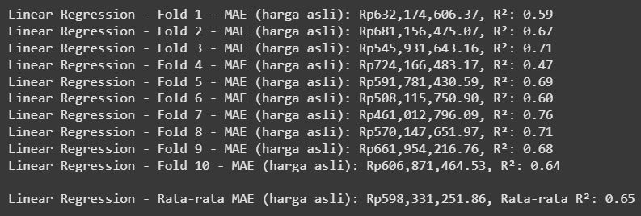
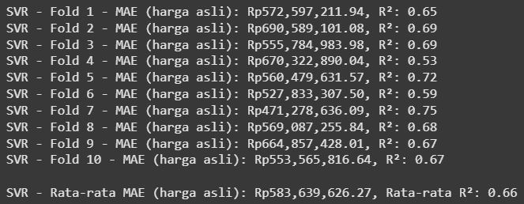

# Laporan Proyek Machine Learning Predictive Analytics - Muhammad Fahmi Hutomo

## Latar Belakang

  Menurut El Mouna et al. (2023), "Prediksi harga rumah merupakan isu utama dalam bidang real estat, keuangan, dan pengembangan. Perkiraan yang akurat terhadap nilai pasar perumahan memungkinkan pembeli, penjual, dan investor membuat keputusan yang lebih terinformasi. Dalam beberapa tahun terakhir, teknik pembelajaran mesin telah memainkan peran penting dalam pengembangan model peramalan harga rumah. Tinjauan ini memberikan gambaran umum tentang penelitian di bidang peramalan harga rumah."
  Harga rumah merupakan salah satu faktor utama yang sangat diperhatikan dalam proses pembelian rumah.  
  
  Di Indonesia, harga rumah dapat sangat bervariasi antar kota, bahkan dalam satu wilayah, bergantung pada beragam faktor seperti lokasi strategis, luas lahan, ukuran bangunan, jumlah kamar, serta fasilitas pendukung di sekitarnya. Perbedaan harga yang sangat bervariasi ini menimbulkan tantangan tersendiri. kondisi pasar yang fluktuatif membuat harga menjadi tidak pasti.

Masalah ketidakpastian harga rumah perlu diselesaikan karena memiliki dampak signifikan bagi berbagai pihak, terutama calon pembeli. Ketidakpastian dalam menentukan harga rumah dapat menyebabkan pembeli menghadapi kerugian karena membeli dengan harga di atas standar tanpa mengetahui kisaran harga pasar saat ini. Di sisi lain, pengembang properti kecil yang tidak memiliki wawasan tentang dinamika harga pasar dapat kehilangan peluang bisnis atau membuat strategi yang tidak efektif ketika menentukan harga borongan untuk pembangunan rumah klien.  Pemanfaatan machine learning dalam melakukan prediksi harga rumah menjadi salah satu solusi yang mampu menangani kompleksitas data historis yang ada, sehingga proses analisis tren harga rumah di daerah tertentu dapat dilakukan dengan lebih mudah.
 
 Referensi: [El Mouna, Lale, Hassan Silkan, Youssef Haynf, Mohamedade Farouk Nann, dan Stéphane C. K. Tekouabou. 2023. A Comparative Study of Urban House Price Prediction using Machine Learning Algorithms](https://www.e3s-conferences.org/articles/e3sconf/abs/2023/55/e3sconf_acc2023_03001/e3sconf_acc2023_03001.html) 

## Business Understanding

### Problem Statements
  - Calon pembeli rumah dihadapkan dengan risiko overpaying karena harga wajar dan terkininya tidak dapat dipastikan kisarannya akibat kurangnya referensi yang bisa diakses calon pembeli secara efisien.

  - Developer properti skala kecil juga berpotensi tidak mendapatkan cukup profit karena ketidakmampuan menganalisis harga terkini di lokasi di mana projek akan dikerjakan.

### Goals
  - Menyediakan model prediksi harga rumah terkini berbasis data riil untuk membantu calon pembeli menghindari overpaying yang jauh di atas harga wajar.

  - Menyediakan model prediksi harga rumah terkini berbasis data riil yang dapat membantu developer memprediksi harga rumah di kota tertentu, sebagaia salah satu faktor penentu nilai proyek yang akan dikerjakan, sehingga  tidak berisiko mengalami kerugian pengerjaan.

### Solution statements
- Mengembangkan model machine learning menggunakan algoritma Linear Regressor dan Support Vector Regressor yang dapat menangkap cukup informasi, yakni dapat menangkap lebih dari 80% variasi harga pasar (R² > 0.80), sehingga prediksi yang diberikan model cukup representatif.
- Mengembangkan model machine learning menggunakan algoritma Linear Regressor dan Support Vector Regressor yang mampu memberikan prediksi harga dengan kesalahan rata-rata absolut(MAE) kurang dari Rp 25.000.000,00 sehingga dapat memperkecil overpaying.
    
## Data Understanding
Dataset Daftar Harga Rumah yang digunakan pada proyek ini dikumpulkan melalui scraping [www.lamudi.co.id](https://www.lamudi.co.id/jual/rumah). Kemudian dipreproses dan disimpan ke dalam file lamudi_house_price.csv yang dapat ditemukan di folder scraping.
  - informasi umum dataset:
    - Dataset terdiri dari 1500 rows dan 7 kolom.
    - Tidak terdapat missing values pada dataset ini.
  -  
  - Keterangan variabel-variabel pada dataset Daftar Harga Rumah: 
    -   Title            : Narasi produk dari penjual.
    -   Price            : Harga rumah (target)
    -   Bedrooms         : Total kamar tidur.  
    -   Living Size(m²)  : Luas bangunan.
    -   Land Size(m²)    : Luas tanah.
    -   Location         : Kota di mana rumah dijual. 
    -   Timestamp        : Waktu data terunduh.  
  
  - Variabel Title dan Timestamp tidak digunakan dalam modeling sehingga akan dihapus di tahap preparation.  

  EDA
  - Pada Variabel Living Size(m²) dan Land Size(m²) terdapat nilai tidak konsisten atau tidak wajar. Yakni, nilai terendah hanya satu digit. Juga ada nilai yang terlampau besar (9 digit) pada Land Size(m²).
  -  
  - Distribusi nilai pada variabel-variabel numerik di dataset ini tidak seimbang (skewed). Selain skewed, variabel-variabel pada dataset ini juga mengandung outlier.
  - 
  -  
  -  
  -  
  - Distribusi nilai variabel kategorik juga tidak seimbang.
  -  

####  Masalah-masalah yang ditemukan:
- Terdapat beberapa nilai tidak wajar pada fitur Living Size dan Land Size.
- Fitur Title dan Timestamp download tidak dibutuhkan.
- Distribusi data di semua fitur tidak seimbang(skewed) dan mengandung outlier.
- Pada fitur Location, beberapa kota hanya muncul sekali.

#### Keputusan yang diambil:
- Menghapus fitur Title dan Timestamp.
- Hanya akan mempertahankan data dengan minimal Living Size dan Land Size seluas 36 m².
- Hanya mempertahankan data dengan kemunculan kota lebih dari 5 kali di fitur Location.
- Melakukan penanganan outlier untuk mengatasi pengaruh outlier pada data keseluruhan.
- Melakukan Transformasi logaritmik untuk mengatasi skewness yang besar.
- Melakukan proses modeling menggunakan kfold cross-validation untuk mengatasi distribusi data tidak seimbang.

## Data Preparation
Langkah-langkah yang dilakukan pada tahap preparation:
1. Melakukan drop fitur yang tidak digunakan untuk modeling, yakni Title dan Timestamp.
2. Menentukan size minimal untuk Living Size dan Land Size sebesar (36 m²). Langkah ini dilakukan karena terdapat beberapa Living Size dan Land Size yang nilainya hanya satuan, seperti 1 m² atau 2 m².
3. Melakukan drop data duplikat. Nilai-nilai duplikat muncul setelah fitur Title dan Timestamp didrop.
4. Memilih data dengan kota yang kemunculannya lebih dari 5 di fitur Location. Langkah ini dilakukan dengan asumsi setiap kota dengan setidaknya 6 data rumah dijual sudah bisa memberikan informasi cukup representatif terkait harga rumah di kota itu.
5. Melakukan penanganan outlier dengan metode IQR.
- Informasi data setelah penanganan outlier:
- 
6. Melakukan transformasi logaritmik untuk variabel numerik yang skewnessnya s di mana s<-1 atau s>1 (kecuali variable 'Price'). Transformasi logaritmik pada variabel Price dilakukan setelah pemisahan target agar nilai tranformasinya dapat di inverse sehingga MAE yang terhitung sama dengan selisih harga asli (dalam rupiah).
7. Pemisahan target Price menjadi `y` dan fitur selain Price (variabel prediktor) menjadi `X`.  
8. Karena proses modeling menggunakan kfold cross validation `kf = KFold(n_splits=10, shuffle=True, random_state=42)`, maka data splitting dilakukan di setiap iterasi kfold `for fold, (train_idx, val_idx) in enumerate(kf.split(X))`.   
Kemudian encoding dan standardisasi dilakukan setelah data splitting agar data evaluasi tidak bocor ke data pelatihan yang dapat menyebabkan overfitting.   
  - Data Splitting (Train vs Validation):  
    - Data `X` dibagi menjadi `X_train` dan `X_val`.  
    - Data `y` dibagi menjadi `y_train` dan `y_val`.    
      ```
      X_train, X_val = X.iloc[train_idx], X.iloc[val_idx]
      y_train, y_val = y.iloc[train_idx], y.iloc[val_idx]
      ```     
  - Encoding dan Standardisasi:  
    - encode `X_train['Location']` dan `X_val['Location']`menggunakan `TargetEncoder`.  
      ```
      encoder = TargetEncoder()
      X_train.loc[:, 'Location'] = encoder.fit_transform(X_train['Location'], y_train)['Location']
      X_val.loc[:, 'Location'] = encoder.transform(X_val['Location'])['Location']
      ```   
    - standardisasi `X_train`, `X_val`, `y_train`, `y_val` menggunakan`StandardScaler`.   
      ```
      # Standarisasi fitur prediktor
      scaler_x = StandardScaler()
      X_train_scaled = scaler_x.fit_transform(X_train)
      X_val_scaled = scaler_x.transform(X_val)
      ```      
      ```
      # Standarisasi target
      scaler_y = StandardScaler()
      y_train_scaled = scaler_y.fit_transform(y_train.values.reshape(-1, 1)).ravel()
      y_val_scaled = scaler_y.transform(y_val.values.reshape(-1, 1)).ravel()
      ```

## Modeling
Pada tahap modeling ini digunakan dua algoritma, yaitu Linear Regressor dan Support Vector Regressor.   
Model dilatih dengan data training yang sudah di encode dan distandardisasi:  
   `model.fit(X_train_scaled, y_train_scaled)`    
Kemudian Melakukan prediksi dengan model yang telah dilatih:    
   `y_pred_scaled = model.predict(X_val_scaled)`


### Linear Regressor

- Cara Kerja    
     Linear Regressor memprediksi nilai target dengan cara menemukan garis lurus terbaik yang menggambarkan hubungan antara variabel independen dan target. 
- Parameter   
    Parameter yang digunakan adalah default parameter.    
    `model = LinearRegression()`
- Kelebihan   
    - Sederhana dan Mudah Diinterpretasikan: regresi linear mudah dipahami dan dijelaskan karena hanya melibatkan hubungan linear.
    - Cepat dan Efisien: cocok untuk dataset kecil hingga sedang, dan tidak memerlukan banyak komputasi.
- Kekurangan    
    - Hanya untuk Hubungan linear: tidak cocok jika hubungan antara variabel independen dan target tidak linear. 
    - Sensitif terhadap Outliers: data yang memiliki outliers dapat secara signifikan memengaruhi model.


### Support Vector Regressor.    

- Cara Kerja    
    SVR memprediksi nilai target dengan menemukan hyperplane yang memaksimalkan margin, memungkinkan model mengabaikan titik data dalam batas toleransi (epsilon) dan fokus pada data di luar margin untuk pembentukan fungsi prediksi yang optimal.
- Parameter   
    `model = SVR(kernel='rbf', C=1.0, gamma=0.1)`
    - kernel='rbf' (menangani non-linearitas).
    - C=1.0 (parameter regularisasi, mengontrol trade-off antara margin dan error).
    - gamma=0.1 (mengontrol pengaruh titik data individual).   
    
- Kelebihan   
    - Mampu menangani data nonlinear. Dapat memodelkan hubungan yang kompleks antara fitur dan target dengan kernel rbf.
    - Tahan terhadap outlier.
    - Fleksibilitas tinggi: Parameter seperti C dan gamma dapat disesuaikan untuk mengontrol regularisasi dan kompleksitas model.
- Kekurangan    
    - Membutuhkan perhatian lebih untuk memilih parameter optimal seperti kernel, C, dan gamma.
    - Lebih lambat dibandingkan Linear Regression, terutama pada dataset yang lebih besar.
    - Sulit diinterpretasikan dibanding Linear Regression

## Evaluation
Metrik Evaluasi yang digunakan adalah MAE dan R².  

- 

  - Menghitung nilai absolut selisih antara nilai aktual dan prediksi.
  - Mengambil rata-rata dari semua nilai absolut selisih tersebut.
  - Nilai MAE yang lebih rendah menunjukkan kesalahan prediksi rata-rata lebih kecil.   

- 

  - Membandingkan variansi error model(Jumlah selisih kuadrat setiap data dengan nilai prediksi model) dengan variansi aktual dalam data (Jumlah selisih kuadrat setiap data dengan nilai rata-rata data). Hasilnya untuk mengurangi 1 sebagai cara untuk memandang seberapa besar peran fitur-fitur yang digunakan dalam model dalam mempengaruhi harga rumah. 
  - Nilai R² berkisar antara 0 hingga 1. Nilai yang lebih tinggi menunjukkan kemampuan model untuk lebih efektif menjelaskan variansi data aktual dibandingkan dengan variansi yang tidak terjelaskan.
  - Misal R² dari model bernilai 0.72, artinya model dapat menjelaskan 72% variasi harga rumah berdasarkan fitur yang digunakan model. Sisanya, 28%, merupakan variasi yang tidak dapat dijelaskan oleh model.  

Agar memperoleh nilai MAE yang sama seperti selisih harga asli dengan harga prediksi maka dilakukan inverse standardisasi dan inverse tranformasi terlebih dulu.    

```
y_pred_log = scaler_y.inverse_transform(y_pred_scaled.reshape(-1, 1)).ravel()  # Inverse standardisasi
y_val_log = scaler_y.inverse_transform(y_val_scaled.reshape(-1, 1)).ravel()
```
```
y_pred_original = np.expm1(y_pred_log)  # Kembali dari log1p ke harga asli
y_val_original = np.expm1(y_val_log)
```   
Evaluasi dilakukan menggunakan nilai asli.    
    `mae = mean_absolute_error(y_val_original, y_pred_original)`    
    `r2 = r2_score(y_val_original, y_pred_original)`

Evaluasi ini dilakukan disetiap kfold dan score dari setiap iterasi Kfold dikumpulkan ke dalam list `mae_scores` dan `r2_scores`.   
    `mae_scores.append(mae)`       
    `r2_scores.append(r2)`    
     
 Setelah cross validation selesai,list dari metrik evaluasi kemudian di hitung nilai rata-ratanya:  
   `np.mean(mae_scores)`    
   `np.mean(r2_scores)`

 Nilai rata-rata score metrik evaluasi ini akan digunakan untuk mengevaluasi kedua model dan menentukan model mana yang lebih baik.

### Linear Regressor  
  - 


### Support Vector Regressor
  - 


### Evaluasi Model
- Model SVR sedikit lebih baik dari model Linear Regressor dengan MAE sekitar 583_639_626 dan R² sekitar 0,66. 
- Namun, performa model SVR tidak bisa dijadikan solusi permasalahan karena metrik evaluasinya masih jauh dengan yang diharapakan pada Solution Statement yang mana diharapkan R² >0,8 dan MAE kurang dari 25_000_000_000.
### Rencana Pengembangan
Pada pengembangan selanjutnya akan dilakukan peningkatan kuantitas dan kualitas dataset dengan sebaran data yang lebih representatif di semua kuantil agar membantu model menangkap pola dengan lebih baik dan meningkatkan generalisasi, serta akan ditambahkan fitur lain yang memiliki korelasi dengan harga rumah agar model yang dihasilkan lebih akurat.
